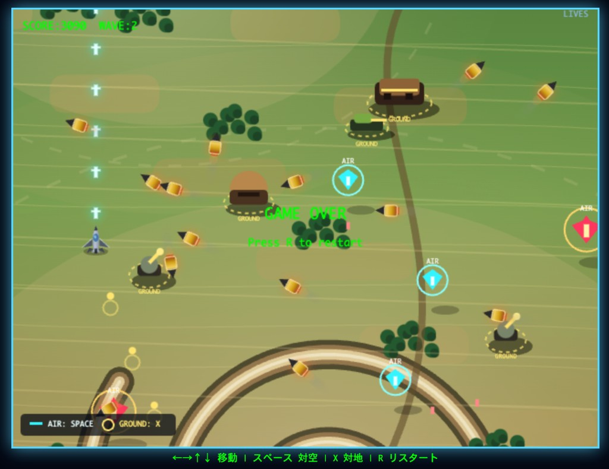

# degima-games

ブラウザで遊べるレトロゲーム集です。タブで「インベーダー」「ポン」「メビウス」を切り替えてプレイできます。

## 技術スタック

- HTML5 Canvas — ゲーム描画
- [serve](https://github.com/vercel/serve) — ローカル開発用静的ファイルサーバー

## ディレクトリ構成

```
degima-games/
├── Makefile              # 開発用（Node.js を .local/ に取得）
├── package.json          # 依存関係・開発サーバー設定
├── games/
│   ├── index.html        # タブ付きシェル（起動時エントリ）
│   ├── invaders.html     # インベーダーゲーム
│   ├── pong.html         # ポンゲーム
│   └── mevius.html       # メビウス（縦スクロール STG）
└── doc/
    ├── design.md         # 設計仕様
    ├── ChangeLog.md      # 変更履歴
    └── screenshots/      # ドキュメント用スクリーンショット
```

## サンプルゲーム

`games/index.html` をブラウザで開くと、画面上部のタブで「インベーダー」「ポン」「メビウス」を切り替えられます。



| 項目 | 内容 |
|------|------|
| 表示領域 | ビューポート全体、タブバー高さ 32px |
| タブ UI | コンパクトなアンダーライン型 |
| ゲーム読み込み | 各ゲームは iframe で分離。ポンは初回タブ選択時に遅延読み込み |
| Canvas | 内部解像度 640×480。CSS でウィンドウ内に自動縮小 |
| スクロール | シェル・各ゲームで `overflow: hidden`、操作キーで `preventDefault()` |

## 前提条件

開発ホスト（`make` を実行するマシン）:

- macOS または Linux（x64 / arm64）
- `make`、`curl` が利用できること

Makefile が Node.js v22.14.0 を `.local/` 以下に自動取得するため、事前に Node.js をインストールする必要はありません。

## 使い方

### 開発（ローカルサーバー起動）

```bash
make run
```

http://localhost:3000 が起動し、ブラウザでサンプルゲームを操作できます。

### クリーンアップ

```bash
make clean
```

`.local/` と `node_modules/` を削除します。

## カスタマイズの入口

| ファイル | 内容 |
|----------|------|
| `games/index.html` | タブ付きシェル（タブ数・レイアウト） |
| `games/` | 各ゲーム HTML（追加・差し替え） |

詳細な設計は [doc/design.md](doc/design.md)、変更履歴は [doc/ChangeLog.md](doc/ChangeLog.md) を参照してください。

## npm スクリプト（参考）

Makefile を使わない場合は、Node.js を用意したうえで次のコマンドでも同等の操作ができます。

```bash
npm install
npm start   # http://localhost:3000 で開発サーバー起動
```

## ライセンス

Apache-2.0（[LICENSE](LICENSE)）
